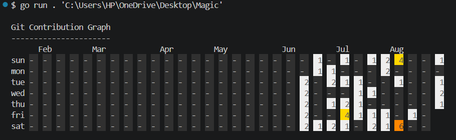

# 📊 Git Contribution Visualizer

A simple command-line interface (CLI) tool written in Go that scans your local directories for Git repositories and generates a GitHub-style contribution graph right in your terminal.

## 🚀 Features

- **Local Scanning:** Scans any given folder for `.git` repositories.
- **GitHub-Style Graph:** Visualizes your commits over the last 6 months in a familiar 7-row grid layout.
- **Offline & Fast:** Works entirely offline using your local `git log` data.

## 🛠️ Installation

### Method 0: for anyone, just run this command in your git bash :)
```bash
curl -fsSL https://raw.githubusercontent.com/halwaii/git-contribution-visualizer/main/run.sh | bash -s -- "."
```

### Method 1: For Go Developers (Recommended)
If you have Go installed on your system, you can easily install the tool globally:

```bash
go install github.com/halwaii/git-contribution-visualizer@latest
```

### Method 2: For Non-Go Users (Pre-built Binaries)
1. Go to the [Releases](https://github.com/jay-xlr8/git-contribution-visualizer/releases) page of this repository.
2. Download the binary that matches your Operating System (Windows `.exe`, Linux, or macOS).
3. (Optional) Add the executable to your system's PATH to run it from anywhere.

## 💻 Usage

Run the command and provide the path to the directory containing your project folders. The tool will scan all subdirectories for `.git` folders.

```bash
# If installed globally via go install:
git-contribution-visualizer "/path/to/your/projects/folder"

# If running the downloaded binary directly (example for Windows):
./git-contribution-visualizer.exe "C:\Users\YourName\Desktop\Projects"
```

## 📸 Example Output
**
